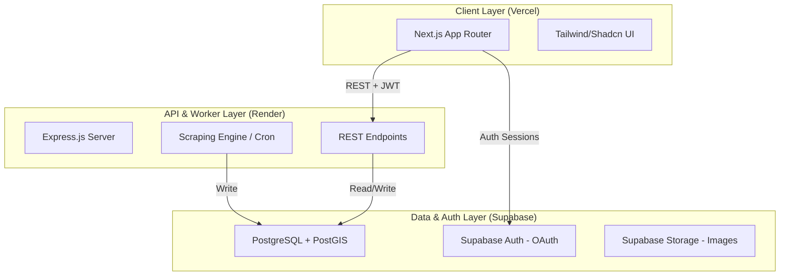

# Technical Design Document: ConcertDaddy MVP

## Executive Summary

**System:** ConcertDaddy
**Version:** MVP 1.0
**Architecture Pattern:** Decoupled Client-Server (Next.js + Express)
**Estimated Effort:** 4–6 weeks

## Architecture Overview

### High-Level Architecture



### Tech Stack Decision

#### Frontend
- **Framework:** Next.js (App Router)
- **Styling:** Tailwind CSS + Shadcn/ui for rapid, accessible component development
- **State Management:** React Context or Zustand for lightweight client state
- **Testing:** Vitest + React Testing Library

#### Backend
- **Runtime:** Node.js (Express.js) hosted on Render
- **Orchestration:** Integrated scraping logic via node-cron or similar, replacing the initial GitHub Actions plan for better persistence
- **Security:** JWT verification for all protected routes; IP-based rate limiting to prevent abuse
- **Validation:** Zod for request validation

#### Data & Infrastructure
- **Primary DB:** Supabase (PostgreSQL + PostGIS) for geo-spatial queries (US-West focus)
- **Auth:** Supabase Auth with OAuth (Google/GitHub) enabled to reduce friction
- **Storage:** Supabase Storage to host venue and artist assets locally
- **Caching:** Upstash Redis for API response caching
- **Payments:** Stripe integration (Pre-production setup)
- **Monitoring:** Sentry for error tracking

## Component Design

### Frontend Architecture

```
src/
├── app/                 # App router (Next.js)
│   ├── page.tsx        # Home/Search
│   ├── events/         # Event listings
│   ├── event/[id]/     # Event detail
│   └── artist/[id]/    # Artist tour view
├── components/
│   ├── ui/             # Base UI components (Shadcn)
│   ├── features/       # Feature-specific components
│   │   ├── search/     # Search components
│   │   ├── price/      # Price display/chart
│   │   └── event/      # Event cards/lists
│   └── layouts/        # Layout components
├── lib/
│   ├── api/           # API client
│   ├── hooks/         # Custom hooks
│   ├── utils/         # Utilities
│   └── stores/        # Zustand stores
├── styles/            # Global styles
└── types/             # TypeScript types
```

### Backend Architecture

```
src/
├── api/
│   ├── routes/        # Route handlers
│   │   ├── events.ts
│   │   ├── venues.ts
│   │   └── prices.ts
│   ├── middleware/    # Express middleware
│   │   ├── auth.ts
│   │   └── rateLimit.ts
│   └── validators/    # Request validation (Zod)
├── services/
│   ├── scraping/      # Data collection
│   │   ├── ticketmaster.ts
│   │   └── seatgeek.ts
│   ├── aggregation/   # Price normalization
│   └── geo/           # PostGIS queries
├── models/            # Data models
├── db/
│   ├── migrations/    # Database migrations
│   └── seeds/         # Seed data
├── jobs/              # Cron jobs
│   └── priceFetcher.ts
├── utils/             # Shared utilities
└── config/            # Configuration
```

## Database Schema

```sql
-- Enable PostGIS for geographic queries
CREATE EXTENSION IF NOT EXISTS postgis;

-- Venues Table with Geo-spatial support
CREATE TABLE venues (
    id UUID PRIMARY KEY DEFAULT gen_random_uuid(),
    name VARCHAR(255) NOT NULL,
    city VARCHAR(100),
    state VARCHAR(50),
    location GEOGRAPHY(POINT, 4326), -- For ST_DWithin queries
    timezone VARCHAR(50),
    created_at TIMESTAMP DEFAULT CURRENT_TIMESTAMP
);

-- Events Table
CREATE TABLE events (
    id UUID PRIMARY KEY DEFAULT gen_random_uuid(),
    external_id VARCHAR(255) UNIQUE, -- Ticketmaster/SeatGeek ID
    artist_name VARCHAR(255) NOT NULL,
    genre VARCHAR(100),
    venue_id UUID REFERENCES venues(id),
    event_date TIMESTAMP WITH TIME ZONE NOT NULL,
    url TEXT,
    status VARCHAR(50) DEFAULT 'active',
    created_at TIMESTAMP DEFAULT CURRENT_TIMESTAMP,
    updated_at TIMESTAMP DEFAULT CURRENT_TIMESTAMP
);

-- Price History Table (The Core Value)
CREATE TABLE price_history (
    id UUID PRIMARY KEY DEFAULT gen_random_uuid(),
    event_id UUID REFERENCES events(id) ON DELETE CASCADE,
    min_price DECIMAL(10, 2),
    max_price DECIMAL(10, 2),
    avg_price DECIMAL(10, 2),
    source VARCHAR(50) NOT NULL, -- e.g., 'Ticketmaster', 'SeatGeek'
    listing_type VARCHAR(50), -- 'primary' or 'resale'
    section_details JSONB, -- Flexible metadata for row/section info
    recorded_at TIMESTAMP DEFAULT CURRENT_TIMESTAMP
);

-- Indices for performance
CREATE INDEX idx_events_artist ON events(artist_name);
CREATE INDEX idx_events_date ON events(event_date);
CREATE INDEX idx_events_venue ON events(venue_id);
CREATE INDEX idx_price_event_date ON price_history(event_id, recorded_at);
CREATE INDEX idx_price_source ON price_history(source);
CREATE INDEX idx_venues_location ON venues USING GIST(location);
```

## Feature Implementation

### Feature 1: Event Search

#### API Design
```typescript
// Endpoint definitions
GET    /api/events                    // Search/List events
GET    /api/events/:id                // Get event details
GET    /api/events/:id/prices         // Get price history
GET    /api/artists/:name/events      // Get artist tour dates

// Request/Response types
interface SearchEventsRequest {
  query?: string;           // Artist or venue name
  lat?: number;             // User latitude
  lon?: number;             // User longitude
  radius?: number;          // Search radius in miles
  dateFrom?: string;        // ISO date
  dateTo?: string;          // ISO date
  limit?: number;
  offset?: number;
}

interface EventResponse {
  id: string;
  artistName: string;
  venue: VenueResponse;
  eventDate: Date;
  currentMinPrice: number;
  currentMaxPrice: number;
  priceChange24h: number;   // Percentage change
}
```

#### Business Logic
```typescript
class EventService {
  async search(filters: SearchEventsRequest): Promise<EventResponse[]> {
    // Build query with filters
    // Apply geo-spatial filtering if lat/lon provided
    // Join with latest price data
    // Apply pagination
    // Cache results in Redis
  }

  async getWithPriceHistory(eventId: string): Promise<EventWithHistory> {
    // Fetch event details
    // Fetch full price history
    // Calculate statistics (min, max, avg, trend)
  }
}
```

### Feature 2: Cross-Venue Comparison

#### API Design
```typescript
GET /api/compare/artist/:name    // Compare prices across venues

interface ComparisonResponse {
  artistName: string;
  events: Array<{
    venue: VenueResponse;
    eventDate: Date;
    minPrice: number;
    maxPrice: number;
    distanceFromUser?: number;
  }>;
}
```

### Feature 3: Price History Visualization

#### Frontend Component
```typescript
// Using recharts for visualization
interface PriceChartProps {
  eventId: string;
  priceHistory: PricePoint[];
}

// Chart displays:
// - Line chart of min/max prices over time
// - Source differentiation (Ticketmaster vs SeatGeek)
// - Primary vs resale pricing
```

### Feature 4: US-West Geo-Search

```typescript
// Supabase RPC function for nearby venues
const { data, error } = await supabase.rpc('get_venues_nearby', {
  user_lon: -122.4194,
  user_lat: 37.7749,
  dist_meters: 80467 // 50 miles
});
```

```sql
-- PostgreSQL function
CREATE OR REPLACE FUNCTION get_venues_nearby(
  user_lon FLOAT,
  user_lat FLOAT,
  dist_meters INT
)
RETURNS SETOF venues AS $$
  SELECT *
  FROM venues
  WHERE ST_DWithin(
    location,
    ST_MakePoint(user_lon, user_lat)::geography,
    dist_meters
  )
  ORDER BY location <-> ST_MakePoint(user_lon, user_lat)::geography;
$$ LANGUAGE SQL;
```

### Feature 5: Similar Price Comparison

```sql
-- Query for similarly priced tickets
SELECT * FROM price_history
WHERE event_id = $1
  AND min_price BETWEEN $2 * 0.85 AND $2 * 1.15
  AND section_details->>'section' != $3
ORDER BY recorded_at DESC
LIMIT 10;
```

## Security Implementation

### Authentication & Authorization

```typescript
// JWT-based auth with Supabase
interface AuthStrategy {
  provider: 'oauth';  // Google/GitHub via Supabase
  tokenExpiry: '1h';
  refreshExpiry: '7d';
}

// Middleware for protected routes
const authenticate = async (req, res, next) => {
  const token = req.headers.authorization?.replace('Bearer ', '');
  const { data: user, error } = await supabase.auth.getUser(token);
  if (error) return res.status(401).json({ error: 'Unauthorized' });
  req.user = user;
  next();
};
```

### Security Requirements

| Requirement | Implementation |
|-------------|----------------|
| CCPA | Provide "Data Deletion" endpoints and clear privacy policy regarding OAuth data |
| Auth | Supabase Auth (JWT) passed in `Authorization: Bearer <token>` headers to Express |
| Encryption | Data encrypted at rest via Supabase (AWS KMS) |
| CORS | Strict whitelist: `ALLOW_ORIGIN=https://concertdaddy.vercel.app` (No `*` in prod) |
| Rate Limiting | `express-rate-limit` based on IP address to prevent abuse |
| API Keys | Stored in environment variables, never exposed client-side |

## Performance Optimization

### Caching Strategy
- **Browser Cache:** Static assets (1 year)
- **CDN Cache:** Vercel Edge caching for pages
- **Application Cache:** Upstash Redis for API responses (5 min TTL)
- **Database Cache:** Query result caching for frequently accessed events

### Optimization Techniques
```typescript
// Database query optimization
const results = await supabase
  .from('events')
  .select('id, artist_name, event_date, venue:venues(name, city)')
  .eq('status', 'active')
  .gte('event_date', new Date().toISOString())
  .order('event_date')
  .range(offset, offset + limit - 1);
```

## Development Workflow

### AI-Assisted Development Strategy

| Phase | Primary Tool | Secondary Tool | Purpose |
|-------|--------------|----------------|---------|
| Architecture | Claude | ChatGPT | System design |
| Implementation | Claude Code | Cursor | Code generation |
| Debugging | Claude Code | ChatGPT | Problem solving |
| Testing | GitHub Copilot | Claude | Test generation |
| Documentation | ChatGPT | Claude | Docs writing |

### Git Workflow
```
main
├── develop
│   ├── feature/[feature-name]
│   ├── fix/[bug-fix]
│   └── chore/[maintenance]
└── release/[version]
```

### CI/CD Pipeline

```yaml
# .github/workflows/deploy.yml
name: Deploy
on:
  push:
    branches: [main]

jobs:
  test:
    runs-on: ubuntu-latest
    steps:
      - uses: actions/checkout@v4
      - run: npm ci
      - run: npm run lint
      - run: npm test
      - run: npm run build

  deploy-frontend:
    needs: test
    runs-on: ubuntu-latest
    steps:
      - uses: actions/checkout@v4
      - uses: amondnet/vercel-action@v25
        with:
          vercel-token: ${{ secrets.VERCEL_TOKEN }}
          vercel-org-id: ${{ secrets.VERCEL_ORG_ID }}
          vercel-project-id: ${{ secrets.VERCEL_PROJECT_ID }}

  deploy-backend:
    needs: test
    runs-on: ubuntu-latest
    steps:
      - uses: actions/checkout@v4
      - uses: johnbeynon/render-deploy-action@v0.0.8
        with:
          service-id: ${{ secrets.RENDER_SERVICE_ID }}
          api-key: ${{ secrets.RENDER_API_KEY }}
```

## Testing Strategy

### Test Coverage Targets
- Unit Tests: 80% coverage on services
- Integration Tests: Critical API paths
- E2E Tests: Main user journeys (search, view event, compare)

### Testing Stack
```typescript
// Unit testing with Vitest
describe('EventService', () => {
  it('should search events by artist', async () => {
    const results = await eventService.search({ query: 'Taylor Swift' });
    expect(results).toBeInstanceOf(Array);
    expect(results[0]).toHaveProperty('artistName');
  });
});

// E2E testing with Playwright
test('user can search and view event', async ({ page }) => {
  await page.goto('/');
  await page.fill('[data-testid=search-input]', 'Beyonce');
  await page.click('[data-testid=search-button]');
  await expect(page.locator('[data-testid=event-card]')).toBeVisible();
});
```

## Deployment

### Environment Configuration

```bash
# Frontend (.env.local)
NEXT_PUBLIC_SUPABASE_URL=https://xxx.supabase.co
NEXT_PUBLIC_SUPABASE_ANON_KEY=xxx
NEXT_PUBLIC_API_URL=https://api.concertdaddy.com

# Backend (.env)
DATABASE_URL=postgresql://...
SUPABASE_SERVICE_KEY=xxx
TICKETMASTER_API_KEY=xxx
SEATGEEK_API_KEY=xxx
UPSTASH_REDIS_URL=xxx
SENTRY_DSN=xxx
```

### Deployment Targets

| Component | Platform | Trigger |
|-----------|----------|---------|
| Frontend | Vercel | Push to `main` |
| Backend | Render | Push to `main` |
| Database | Supabase | Manual migrations |

## Monitoring & Observability

### Metrics to Track
- **Application:** Response time, error rate, cache hit ratio
- **Business:** Searches per day, events viewed, API usage by source
- **Infrastructure:** Server CPU, memory, database connections

### Logging Strategy
```typescript
// Structured logging with Pino
logger.info({
  event: 'price_fetch',
  source: 'ticketmaster',
  eventsUpdated: 150,
  duration: 3420
});
```

## Cost Analysis

### Running Costs (Monthly)

| Service | Tier | Cost |
|---------|------|------|
| Frontend (Vercel) | Hobby | $0 |
| Backend (Render) | Web Service | $0 - $7 (Individual tier if sleep-prevention needed) |
| Database (Supabase) | Free | $0 (Up to 500MB storage) |
| Cache (Upstash) | Free | $0 (Up to 10K requests/day) |
| Payments (Stripe) | Pay-as-you-go | Fees only on transactions |
| **Total** | | **$0 - $7/month** |

### Scaling Costs (Future)

| Users | Monthly Cost | Notes |
|-------|--------------|-------|
| 0-1K | $0-7 | Free tiers sufficient |
| 1K-10K | $25-50 | Upgrade Supabase + Render |
| 10K+ | $100+ | Consider dedicated infrastructure |

## Risk Mitigation

| Risk | Probability | Impact | Mitigation |
|------|-------------|--------|------------|
| API rate limits | Medium | High | Aggressive caching with Upstash; batch requests |
| Data staleness | Medium | Medium | Hourly cron jobs; display "last updated" timestamp |
| Scraping breakage | High | Medium | Prefer official APIs; abstract scraping logic |
| Cost overrun | Low | Medium | Set up billing alerts; use free tiers |
| Security breach | Low | High | Regular dependency updates; follow security best practices |

## Migration & Scaling Path

### Phase 1: MVP (0-1K users)
- Current architecture handles well
- Monitor performance metrics
- Gather user feedback

### Phase 2: Growth (1K-10K users)
- Upgrade to paid tiers
- Add more comprehensive caching
- Implement background job queue (BullMQ)

### Phase 3: Scale (10K+ users)
- Consider read replicas
- Multi-region deployment
- Advanced monitoring with DataDog

## Documentation Requirements

- [ ] API documentation (OpenAPI/Swagger)
- [ ] Database schema documentation
- [ ] Deployment runbook
- [ ] Environment setup guide
- [ ] Contributing guidelines

---
*Version: 1.0*
*Last Updated: 2026-02-07*
*Status: Ready for Implementation*
